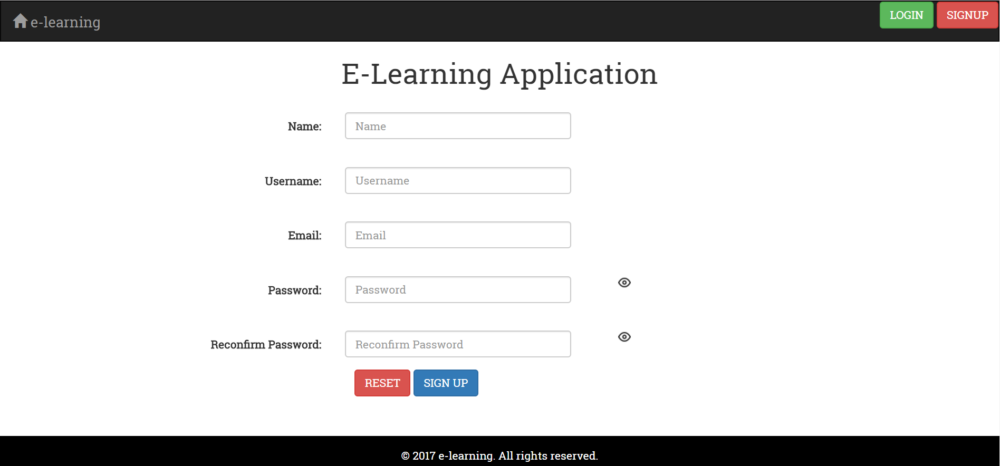
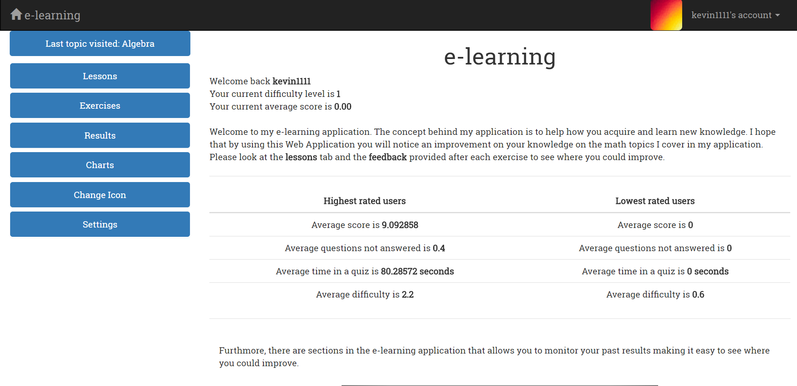
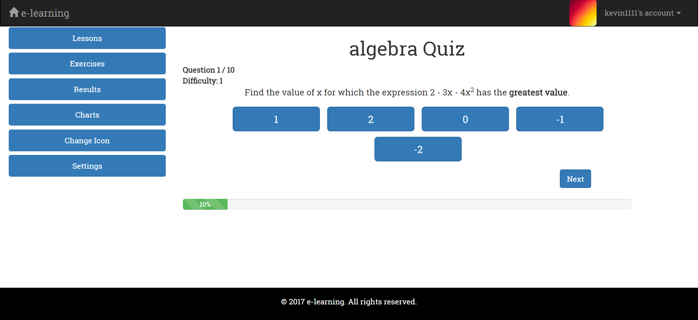

# GITHUB_localhost_fyp
<strong>Description:</strong>My Final Year Project involved developing a fully working and extensive e-learning system using both front-end and back-end technologies hosted by Amazon Web Services. It was predominantly built with the use of PHP. Other e-learning systems were examined to see where they might be refined. The project used algorithms to adjust the difficulty of the questions based on the student’s average score. This method allows for a customized user-friendly experience regardless of the user’s ability. The user interface was designed to make the application straightforward and be navigational on any device size. The appearance of the application can be tailored to the user’s criteria to provide a more personalized experience. 

<strong>Screenshot One:</strong>

  

<strong>Screenshot Two:</strong>

  

<strong>Screenshot Three:</strong>

  

